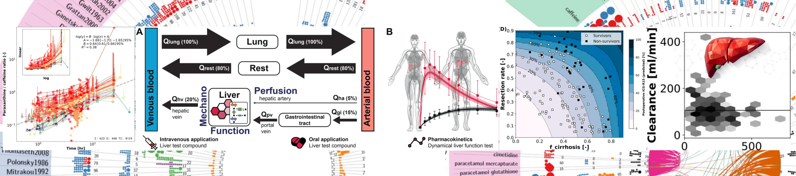

# Course pharmacokinetic modelling
This repository contains the information for a pharmacokinetic modelling course of the [König Systems Medicine of Liver Lab](https://livermetabolism.com). 



Pharmacokinetic modelling is the study of how drugs are absorbed, distributed, metabolised and excreted in the body. The pharmacokinetic modelling course covers topics such as pharmacokinetic principles, drug distribution, clearance and elimination and the factors that influence these processes. Students will learn about different models used to describe pharmacokinetics, such as compartmental models and physiologically based pharmacokinetic models, and how these models can be used to predict drug concentrations and optimise dosing regimens. Other topics that may be covered include pharmacodynamics, drug-drug interactions and the use of pharmacokinetic modelling in drug development and clinical practice. Overall, a course in pharmacokinetic modelling will provide students with a comprehensive understanding of the principles and techniques used to describe the movement of drugs through the body and how this knowledge can be applied to improve drug therapy. For further information please visit: https://livermetabolism.com

All course material is available from: [https://github.com/matthiaskoenig/course-pharmacokinetic-modelling](https://github.com/matthiaskoenig/course-pharmacokinetic-modelling)

The course content consists of
- [`./lectures/`](./lectures/): Presentations for the parts of the course
- [`./course/`](./course/): PDFs for the course material
- [`./src/mb19/notebooks/`](./src/mb19/notebooks/): IPython notebooks for the course material

Have a look at the lectures first, then at the corresponding course material, then run and modify the python notebooks.

## Git
All data and code is managed using git as version control system in combination with [GitHub](https://github.com).

### Git client
To use git on the command line, you will need to download, install, and configure Git on your computer. You can also install GitHub CLI to use GitHub from the command line. For more information, see "[About GitHub CLI.](https://docs.github.com/en/github-cli/github-cli/about-github-cli)".

If you want to work with Git locally, but do not want to use the command line, you can instead download and install the [GitHub Desktop](https://desktop.github.com/) client. For more information, see "[Installing and configuring GitHub Desktop.](https://docs.github.com/en/desktop/installing-and-configuring-github-desktop)"

### Setup authentification
In case you have issues with git authentification see: For authenficiation issues see: https://github.com/GitCredentialManager/git-credential-manager#linux-install-instructions.

### Clone the repository
Setup a git client on your system and clone the repository https://github.com/matthiaskoenig/course-pharmacokinetic-modelling.git

First you should create a folder for your git projects and change to the folder. 
```
mkdir git
cd git
```

You can now clone the repository via
``` 
git clone https://github.com/matthiaskoenig/course-pharmacokinetic-modelling.git
```
The content of the repository is in the `course-pharmacokinetic-modelling` folder. Change to the directory
via
```
cd course-pharmacokinetic-modelling
```

## Setup Python
The next step is to setup a Python environment and install the dependencies. For windows and MacOS we recommend to use anaconda. Please follow the installation instructions on https://docs.anaconda.com/anaconda/install/index.html to setup an anaconda system

### Anaconda
With anaconda installed you can open the `Anaconda Prompt` or `Anaconda PowerShell` via the program starter.

In the consolue you can create a virtual environment for conda via 
```
conda create -n pkmodels
```

The python dependencies can be installed in a virtual environment via:

```
cd course-pharmacokinetic-modelling
conda activate pkmodels
(pkmodels) pip install -r requirements.txt
(pkmodels) conda install nb_conda_kernels
(pkmodels) conda install -n mb19 ipykernel 
```

### Virtualenv
Alternative use virtualenv for setting up the system
```
mkvirtualenv pkmodels
(pkmodels) pip install -r requirements.txt
```
Use virtualenv as jupyter kernel
```
(pkmodels) python -m ipykernel install --user --name=pkmodels
```

## Notebooks (JupyterLab, Jupyter Notebooks)
With the created environment the notebooks in
[`./src/mb19/notebooks/`](./src/mb19/notebooks/)
can be executed. Run JupyterLab or Jupyter Notebook and open the `*.ipynb` notebooks

```
jupyter lab
```

## Spyder
```bash
(pkmodels) pip install spyder
```

## Convert material to PDF
To create PDFs from the jupyter notebooks use
```
sudo apt-get install texlive-xetex texlive-fonts-recommended texlive-plain-generic

jupyter nbconvert --to pdf 01_structural_models.ipynb
jupyter nbconvert --to pdf 02_ordinary_differential_equations.ipynb
jupyter nbconvert --to pdf 03_compartment_model.ipynb
jupyter nbconvert --to pdf 04_absorption.ipynb
jupyter nbconvert --to pdf 05_multiple_dosing.ipynb
jupyter nbconvert --to pdf 06_metabolism.ipynb
jupyter nbconvert --to pdf 07_pharmacokinetic_parameters.ipynb
jupyter nbconvert --to pdf 08_variability.ipynb
jupyter nbconvert --to pdf 09_sbml.ipynb
jupyter nbconvert --to pdf 10_pharmacodynamics.ipynb
jupyter nbconvert --to pdf 11_pbpk_tutorial.ipynb
```

```bash
pdfunite 01_structural_models.pdf 02_ordinary_differential_equations.pdf 03_compartment_model.pdf 04_absorption.pdf 05_multiple_dosing.pdf 06_metabolism.pdf 07_pharmacokinetic_parameters.pdf 08_variability.pdf 09_sbml.pdf 10_pharmacodynamics.pdf 11_pbpk_tutorial.pdf pkcourse.pdf
```

© 2023-2024 [Matthias König](https://livermetabolism.com)
